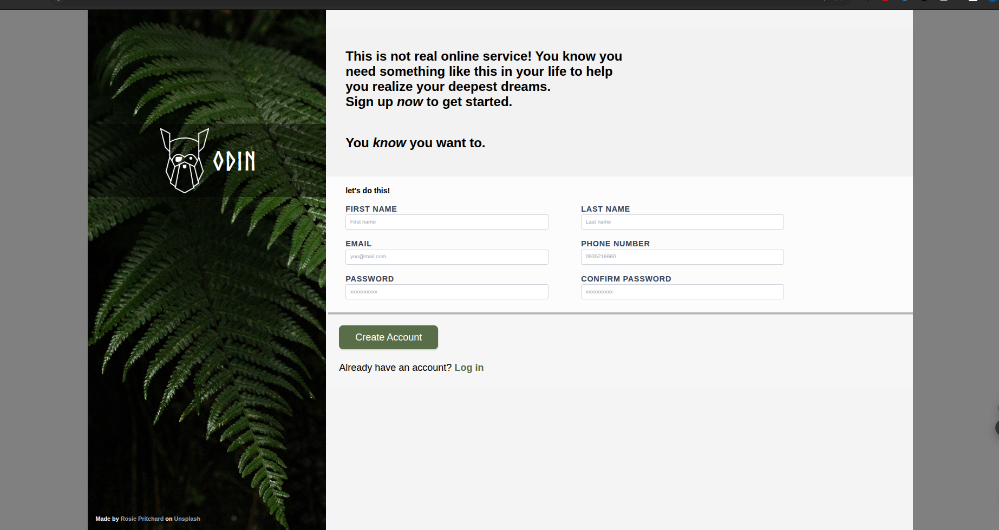

# Sign-up-form
Form project form TOP intermidiate css and html course, intended to practice form stayle.

# Fearures
- responsive
- client-side validation


# Installation
[sign-up-form](https://github.com/dontaa11/sign-up-form.git)
``` bash
git clone sign-up-form
cd your-repo
 code .
```
-use for practice only

# Desktop view 
**Image** 

# Mobile view
**Image** 


# Credit 
- Image by [Rosie Pritchard](https://unsplash.com/@every_small_step_?utm_source=unsplash&utm_medium=referral&utm_content=creditCopyText)